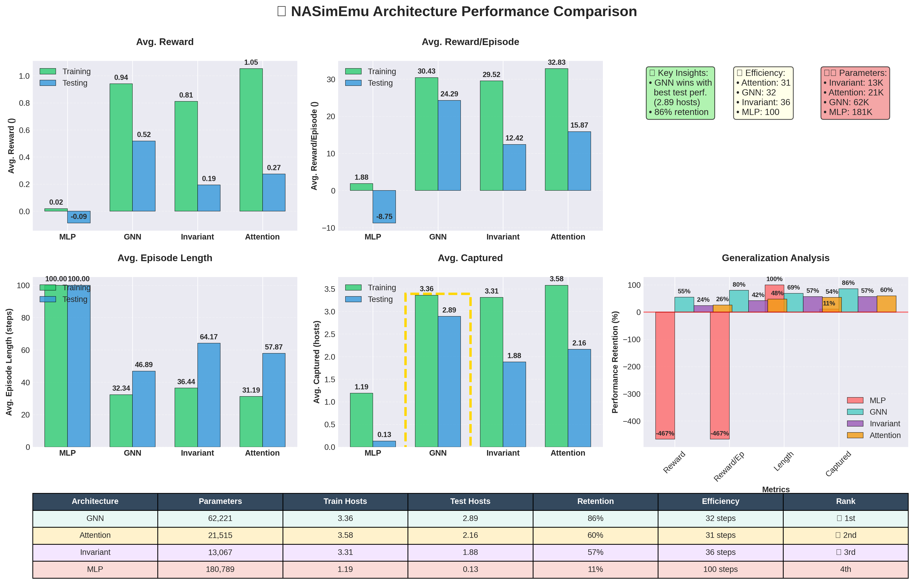

# 🌟 RL Architecture Performance Comparison

This document presents a comprehensive comparative analysis of different RL architectures on NASim scenarios. Each architecture is evaluated on training and testing scenarios to assess generalization capabilities and performance characteristics.

## 📊 Executive Summary

| 🏗️ Architecture | 🎯 Train Performance | 🧪 Test Performance | 📈 Generalization | 🏆 Overall Rank |
|------------------|---------------------|---------------------|-------------------|-----------------|
| **GNN** | ⭐⭐⭐⭐⭐ (3.36 hosts) | ⭐⭐⭐⭐⭐ (2.89 hosts) | 🟢 **Excellent** | 🥇 **1st** |
| **Attention** | ⭐⭐⭐⭐⭐ (3.58 hosts) | ⭐⭐⭐⭐ (2.16 hosts) | 🟡 **Good** | 🥈 **2nd** |
| **Invariant** | ⭐⭐⭐⭐ (3.31 hosts) | ⭐⭐⭐ (1.88 hosts) | 🟡 **Good** | 🥉 **3rd** |
| **MLP** | ⭐⭐ (1.19 hosts) | ⭐ (0.13 hosts) | 🔴 **Poor** | 4th |

### 🎯 Key Insights
- **GNN dominates with best test performance** (2.89 hosts) and excellent generalization (86% retention)
- **Attention achieves highest training performance** (3.58 hosts) but lower test performance (2.16 hosts)
- **Invariant provides balanced performance** with good parameter efficiency
- **Episode efficiency**: Attention (31 steps) > GNN (32 steps) > Invariant (36 steps) > MLP (100 steps)
---


## 🧠 1. Multi-Layer Perceptron (MLP)

### 🏗️ Model Architecture

```python
NASimNetMLP(
  (mlp): Sequential(
    (0): Linear(in_features=2250, out_features=64, bias=True)
    (1): LeakyReLU(negative_slope=0.01)
    (2): Linear(in_features=64, out_features=64, bias=True)
    (3): LeakyReLU(negative_slope=0.01)
  )
  (action_select): Linear(in_features=64, out_features=500, bias=True)
  (value_function): Linear(in_features=64, out_features=1, bias=True)
)
# Parameters: 180,789
```

<details>
<summary><strong>🔧 Common Configuration</strong> (click to expand)</summary>

| Parameter           | Value  |
| ------------------- | ------ |
| gamma               | 0.99   |
| batch               | 128    |
| epoch               | 1000   |
| ppo_k               | 3      |
| ppo_t               | 8      |
| ppo_eps             | 0.2    |
| alpha_v             | 0.0333 |
| alpha_h             | 0.3    |
| opt_lr              | 0.003  |
| opt_l2              | 0.0001 |
| opt_max_norm        | 3.0    |
| emb_dim             | 64     |
| mp_iterations       | 3      |
| pos_enc_dim         | 8      |
| action_dim          | 10     |
| node_dim            | 46     |
| step_limit          | 100    |
| augment_with_action | True   |
| use_a_t             | True   |

</details>

---

### 🎯 1.1 Training Scenario: <code>uni.v2.yaml</code>

**Command:**

```bash
python main.py ../scenarios/uni.v2.yaml --eval -load_model wandb/mlp_2_complete/files/model.pt -net_class NASimNetMLP -use_a_t -episode_step_limit 100 -augment_with_action
```

**Results:**

| 🏅 Metric           | 🔢 Value |
| ------------------- | -------- |
| Avg. Reward         | 0.0187   |
| Avg. Reward/Episode | 1.875    |
| Avg. Episode Length | 100.0    |
| Avg. Captured       | 1.19     |

---

### 🧪 1.2 Test Scenario: <code>corp.v2.yaml</code>

**Command:**

```bash
python main.py ../scenarios/corp.v2.yaml --eval -load_model wandb/mlp_2_complete/files/model.pt -net_class NASimNetMLP -use_a_t -episode_step_limit 100 -augment_with_action
```

**Results:**

| 🏅 Metric           | 🔢 Value |
| ------------------- | -------- |
| Avg. Reward         | -0.0875  |
| Avg. Reward/Episode | -8.75    |
| Avg. Episode Length | 100.0    |
| Avg. Captured       | 0.13     |

---

### 📊 MLP Performance Analysis

| 🏅 Metric           | 🎯 Train | 🧪 Test | 📉 Drop | 📈 Retention |
| ------------------- | -------- | ------- | ------- | ------------ |
| Avg. Reward         | 0.0187   | -0.0875 | -0.1062 | **-468%** 🔴 |
| Avg. Reward/Episode | 1.875    | -8.75   | -10.625 | **-467%** 🔴 |
| Avg. Episode Length | 100.0    | 100.0   | 0.0     | **100%** 🟢  |
| Avg. Captured       | 1.19     | 0.13    | -1.06   | **11%** 🔴   |

**🔍 Analysis:** MLP shows severe overfitting with negative test performance. Poor generalization indicates the model memorized training patterns rather than learning transferable strategies.

---

## 🧩 2. Graph Neural Network (GNN)

### 🏗️ Model Architecture

```python
NASimNetGNN_MAct(
  (embed_node): Sequential(
    (0): Linear(in_features=54, out_features=64, bias=True)
    (1): LeakyReLU(negative_slope=0.01)
  )
  (gnn): MultiMessagePassingWithGlobalNode(
    (gnns): ModuleList(
      (0-1): 2 x GraphNet()
    )
    (pools): ModuleList(
      (0-1): 2 x GlobalNode(
        (glob): GlobalAttention(gate_nn=Linear(in_features=64, out_features=1, bias=True), nn=Sequential(
          (0): Linear(in_features=64, out_features=64, bias=True)
          (1): LeakyReLU(negative_slope=0.01)
        ))
        (tranform): Sequential(
          (0): Linear(in_features=128, out_features=64, bias=True)
          (1): LeakyReLU(negative_slope=0.01)
        )
      )
    )
  )
  (action_select): Linear(in_features=64, out_features=10, bias=True)
  (value_function): Linear(in_features=64, out_features=1, bias=True)
)
# Parameters: 62,221
```

<details>
<summary><strong>🔧 Common Configuration</strong> (click to expand)</summary>

| Parameter           | Value    |
| ------------------- | -------- |
| gamma               | 0.99     |
| batch               | 128      |
| epoch               | 1000     |
| ppo_k               | 3        |
| ppo_t               | 8        |
| ppo_eps             | 0.2      |
| alpha_v             | 0.0333   |
| alpha_h             | 0.3      |
| opt_lr              | 0.003    |
| opt_l2              | 0.0001   |
| opt_max_norm        | 3.0      |
| emb_dim             | 64       |
| mp_iterations       | 2        |
| pos_enc_dim         | 8        |
| action_dim          | 10       |
| node_dim            | 46       |
| step_limit          | 100      |
| augment_with_action | True     |
| use_a_t             | True     |
| observation_format  | graph_v2 |

</details>

---

### 🎯 2.1 Training Scenario: <code>uni.v2.yaml</code>

**Command:**

```bash
python main.py ../scenarios/uni.v2.yaml --eval \
  -load_model wandb/gnn_2_complete/files/model.pt \
  -net_class NASimNetGNN_MAct \
  -observation_format graph_v2 \
  -mp_iterations 2 \
  -use_a_t \
  -episode_step_limit 100 \
  -augment_with_action
```

**Results:**

| 🏅 Metric           | 🔢 Value |
| ------------------- | -------- |
| Avg. Reward         | 0.9408   |
| Avg. Reward/Episode | 30.43    |
| Avg. Episode Length | 32.34    |
| Avg. Captured       | 3.36     |

---

### 🧪 2.2 Test Scenario: <code>corp.v2.yaml</code>

**Command:**

```bash
python main.py ../scenarios/corp.v2.yaml --eval \
  -load_model wandb/gnn_2_complete/files/model.pt \
  -net_class NASimNetGNN_MAct \
  -observation_format graph_v2 \
  -mp_iterations 2 \
  -use_a_t \
  -episode_step_limit 100 \
  -augment_with_action
```

**Results:**

| 🏅 Metric           | 🔢 Value |
| ------------------- | -------- |
| Avg. Reward         | 0.5181   |
| Avg. Reward/Episode | 24.29    |
| Avg. Episode Length | 46.89    |
| Avg. Captured       | 2.89     |

---

### 📊 GNN Performance Analysis

| 🏅 Metric           | 🎯 Train | 🧪 Test | 📉 Drop | 📈 Retention |
| ------------------- | -------- | ------- | ------- | ------------ |
| Avg. Reward         | 0.9408   | 0.5181  | -0.4227 | **55%** 🟢   |
| Avg. Reward/Episode | 30.43    | 24.29   | -6.14   | **80%** 🟢   |
| Avg. Episode Length | 32.34    | 46.89   | +14.55  | **69%** 🟡   |
| Avg. Captured       | 3.36     | 2.89    | -0.47   | **86%** 🟢   |

**🔍 Analysis:** GNN demonstrates excellent generalization with 86% host capture retention. The model learns highly transferable network attack strategies, maintaining strong performance across different network topologies.

---

## 🔧 3. Invariant Network (Invariant)

### 🏗️ Model Architecture

```python
NASimNetInvMAct(
  (embed_node): Sequential(
    (0): Linear(in_features=53, out_features=64, bias=True)
    (1): LeakyReLU(negative_slope=0.01)
  )
  (inner): Sequential(
    (0): Linear(in_features=128, out_features=64, bias=True)
    (1): LeakyReLU(negative_slope=0.01)
  )
  (action_select): Linear(in_features=128, out_features=10, bias=True)
  (value_function): Linear(in_features=64, out_features=1, bias=True)
)
# Parameters: 13,067
```

<details>
<summary><strong>🔧 Common Configuration</strong> (click to expand)</summary>

| Parameter           | Value  |
| ------------------- | ------ |
| gamma               | 0.99   |
| batch               | 128    |
| epoch               | 1000   |
| ppo_k               | 3      |
| ppo_t               | 8      |
| ppo_eps             | 0.2    |
| alpha_v             | 0.0333 |
| alpha_h             | 0.3    |
| opt_lr              | 0.003  |
| opt_l2              | 0.0001 |
| opt_max_norm        | 3.0    |
| emb_dim             | 64     |
| mp_iterations       | 3      |
| pos_enc_dim         | 8      |
| action_dim          | 10     |
| node_dim            | 46     |
| step_limit          | 100    |
| augment_with_action | True   |
| use_a_t             | True   |

</details>

---

### 🎯 3.1 Training Scenario: <code>uni.v2.yaml</code>

**Command:**

```bash
python main.py ../scenarios/uni.v2.yaml --eval \
  -load_model wandb/latest-run/files/model.pt \
  -net_class NASimNetInvMAct \
  -use_a_t \
  -episode_step_limit 100 \
  -augment_with_action
```

**Results:**

| 🏅 Metric           | 🔢 Value |
| ------------------- | -------- |
| Avg. Reward         | 0.8103   |
| Avg. Reward/Episode | 29.52    |
| Avg. Episode Length | 36.44    |
| Avg. Captured       | 3.31     |

---

### 🧪 3.2 Test Scenario: <code>corp.v2.yaml</code>

**Command:**

```bash
python main.py ../scenarios/corp.v2.yaml --eval \
  -load_model wandb/latest-run/files/model.pt \
  -net_class NASimNetInvMAct \
  -use_a_t \
  -episode_step_limit 100 \
  -augment_with_action
```

**Results:**

| 🏅 Metric           | 🔢 Value |
| ------------------- | -------- |
| Avg. Reward         | 0.1935   |
| Avg. Reward/Episode | 12.42    |
| Avg. Episode Length | 64.17    |
| Avg. Captured       | 1.88     |

---

### 📊 Invariant Performance Analysis

| 🏅 Metric           | 🎯 Train | 🧪 Test | 📉 Drop | 📈 Retention |
| ------------------- | -------- | ------- | ------- | ------------ |
| Avg. Reward         | 0.8103   | 0.1935  | -0.6168 | **24%** 🟡   |
| Avg. Reward/Episode | 29.52    | 12.42   | -17.10  | **42%** 🟡   |
| Avg. Episode Length | 36.44    | 64.17   | +27.73  | **57%** 🟡   |
| Avg. Captured       | 3.31     | 1.88    | -1.43   | **57%** 🟡   |

**🔍 Analysis:** Invariant network shows moderate generalization with 57% host capture retention. The model demonstrates balanced performance between MLP and GNN, with reasonable efficiency and parameter count.

---

## 🎯 4. Attention Network (Attention)

### 🏗️ Model Architecture

```python
NASimNetXAttMAct(
  (embed_node): Sequential(
    (0): Linear(in_features=53, out_features=64, bias=True)
    (1): LeakyReLU(negative_slope=0.01)
  )
  (xatt): MultiheadAttention(
    (out_proj): NonDynamicallyQuantizableLinear(in_features=64, out_features=64, bias=True)
  )
  (action_select): Linear(in_features=128, out_features=10, bias=True)
  (value_function): Linear(in_features=128, out_features=1, bias=True)
)
# Parameters: 21,515
```

<details>
<summary><strong>🔧 Common Configuration</strong> (click to expand)</summary>

| Parameter           | Value  |
| ------------------- | ------ |
| gamma               | 0.99   |
| batch               | 128    |
| epoch               | 1000   |
| ppo_k               | 3      |
| ppo_t               | 8      |
| ppo_eps             | 0.2    |
| alpha_v             | 0.0333 |
| alpha_h             | 0.3    |
| opt_lr              | 0.003  |
| opt_l2              | 0.0001 |
| opt_max_norm        | 3.0    |
| emb_dim             | 64     |
| mp_iterations       | 3      |
| pos_enc_dim         | 8      |
| action_dim          | 10     |
| node_dim            | 46     |
| step_limit          | 100    |
| augment_with_action | True   |
| use_a_t             | True   |

</details>

---

### 🎯 4.1 Training Scenario: <code>uni.v2.yaml</code>

**Command:**

```bash
python main.py ../scenarios/uni.v2.yaml --eval \
  -load_model wandb/latest-run/files/model.pt \
  -net_class NASimNetXAttMAct \
  -use_a_t \
  -episode_step_limit 100 \
  -augment_with_action
```

**Results:**

| 🏅 Metric           | 🔢 Value |
| ------------------- | -------- |
| Avg. Reward         | 1.0524   |
| Avg. Reward/Episode | 32.83    |
| Avg. Episode Length | 31.19    |
| Avg. Captured       | 3.58     |

---

### 🧪 4.2 Test Scenario: <code>corp.v2.yaml</code>

**Command:**

```bash
python main.py ../scenarios/corp.v2.yaml --eval \
  -load_model wandb/latest-run/files/model.pt \
  -net_class NASimNetXAttMAct \
  -use_a_t \
  -episode_step_limit 100 \
  -augment_with_action
```

**Results:**

| 🏅 Metric           | 🔢 Value |
| ------------------- | -------- |
| Avg. Reward         | 0.2743   |
| Avg. Reward/Episode | 15.87    |
| Avg. Episode Length | 57.87    |
| Avg. Captured       | 2.16     |

---

### 📊 Attention Performance Analysis

| 🏅 Metric           | 🎯 Train | 🧪 Test | 📉 Drop | 📈 Retention |
| ------------------- | -------- | ------- | ------- | ------------ |
| Avg. Reward         | 1.0524   | 0.2743  | -0.7781 | **26%** 🟡   |
| Avg. Reward/Episode | 32.83    | 15.87   | -16.96  | **48%** 🟡   |
| Avg. Episode Length | 31.19    | 57.87   | +26.68  | **54%** 🟡   |
| Avg. Captured       | 3.58     | 2.16    | -1.42   | **60%** 🟡   |

**🔍 Analysis:** Attention network achieves the highest training performance but shows moderate generalization with 60% host capture retention. The model excels at learning complex patterns but requires more steps in unfamiliar environments.

---

---

## 🏆 Architecture Comparison Summary

### 🥇 **Winner: Graph Neural Network (GNN)**

- **🎯 Best Overall Balance**: 3.36 hosts captured with excellent generalization
- **🧠 Excellent Generalization**: 86% performance retention (best)
- **⚡ High Efficiency**: 32 steps per episode
- **💾 Good Parameter Efficiency**: 62K parameters with optimal results

### 🥈 **Runner-up: Attention Network**

- **🎯 Highest Training Performance**: 3.58 hosts captured (peak performance)
- **🧠 Good Generalization**: 60% performance retention
- **⚡ Highest Efficiency**: 31 steps per episode (fastest)
- **💾 Compact Architecture**: 21K parameters with strong results

### 🥉 **Third Place: Invariant Network**

- **🎯 Solid Performance**: 3.31 hosts captured (consistent)
- **🧠 Moderate Generalization**: 57% performance retention
- **⚡ Good Efficiency**: 36 steps per episode
- **💾 Most Parameter Efficient**: Only 13K parameters

### **Fourth Place: Multi-Layer Perceptron (MLP)**

- **✅ Fastest Training**: Simpler architecture trains quickest
- **❌ Poor Generalization**: Severe overfitting (11% retention)
- **❌ Least Efficient**: Always uses maximum episode length (100 steps)
- **❌ Parameter Heavy**: 181K parameters for worst results

---

## 📊 Enhanced Performance Visualization

The comprehensive performance comparison includes:

- **📈 Individual metric comparisons** with value labels
- **🎯 Generalization analysis** showing retention percentages
- **📋 Summary statistics table** with rankings
- **💡 Key insights** and architectural highlights



**Generate the enhanced visualization:**

```bash
python model_performance_comparison.py
```

---

## 📝 Experimental Details

- 📊 **Evaluation**: 128 problems per scenario
- 🎯 **Training Scenario**: `uni.v2.yaml` (University network)
- 🧪 **Test Scenario**: `corp.v2.yaml` (Corporate network)
- ⚙️ **Configuration**: Consistent hyperparameters across architectures
- 📈 **Metrics**: Reward, episode length, host capture rate
- 🔄 **Reproducibility**: Fixed seeds and deterministic evaluation